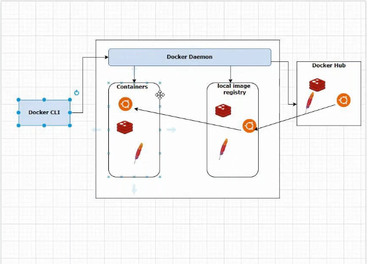

## Adding the user to docker Group 

- sudo usermod -aG docker ec2-user 

## Docker architecture 
 - DockerCLI
 - Docker Daemon
    - cotainers
    - local image registry
 - Docker Hub

 

## Docker commands 
To Get Running  Containers
```
docker ps
```
To Get ALL Running  Containers
```
docker ps -a
```
To pull images
```
docker pull  <image-name>:<image:tage>
```
list Images
```
docker images 
```
Create Container out of image
```
docker create <image-id> 
docker create b692a91e4e15
```
**NOTE :**  `docker create b692a91e4e15` this command will create the container and it was not started 